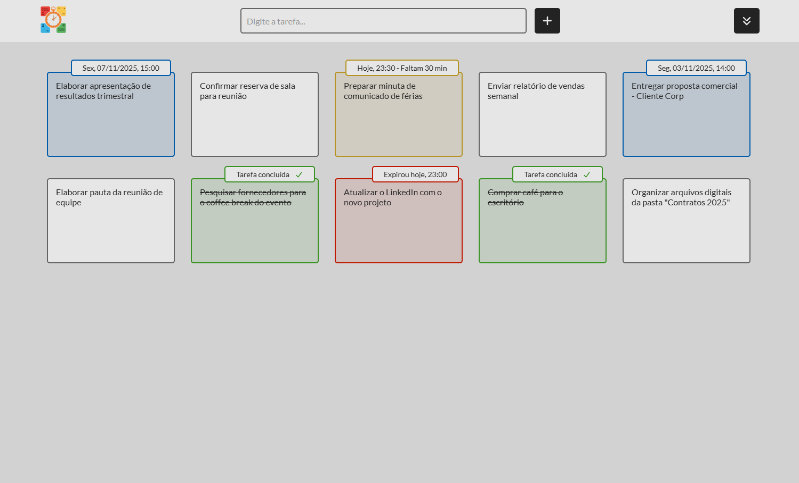

#  Junior Melo

**`Software Developer | Web Developer`**

I'm deeply passionate about technology and creativity. I am strongly committed to continuous learning, applying knowledge from both my formal education and self-study to hands-on projects.

My goal is to contribute to building efficient and intuitive applications, always focusing on clean code and the best user experience. My motto is to always add value, actively pursuing knowledge and growth.

  &nbsp;<a href="README-pt.md">Ler em Português</a>

---

####  Tech Stack

  &nbsp;&nbsp;
  &nbsp;&nbsp;
  &nbsp;&nbsp;
  &nbsp;&nbsp;
  <picture>
    <source media="(prefers-color-scheme: dark)" srcset="https://cdn.simpleicons.org/github/FFFFFF">
    <source media="(prefers-color-scheme: light)" srcset="https://cdn.jsdelivr.net/gh/devicons/devicon@latest/icons/github/github-original.svg">
    &nbsp;&nbsp;
  </picture>
  &nbsp;&nbsp;
  &nbsp;&nbsp;
  &nbsp;&nbsp;
  

####  Currently Learning

  &nbsp;&nbsp;
  &nbsp;&nbsp;
  &nbsp;&nbsp;
  &nbsp;&nbsp;
  

####  Featured Projects

<table>
  <tr>
    <td align="left" width="300">
      
      <b>TasksControl</b>
       
      Task manager with scheduling and real-time tracking.
       
       
      &nbsp;<a href="https://github.com/juniormelo13/tasks_control" alt="View Project">View Project</a>
       
       
      HTML, CSS, JavaScript
    </td>
  </tr>
</table>

####  Contact

  
  
  

